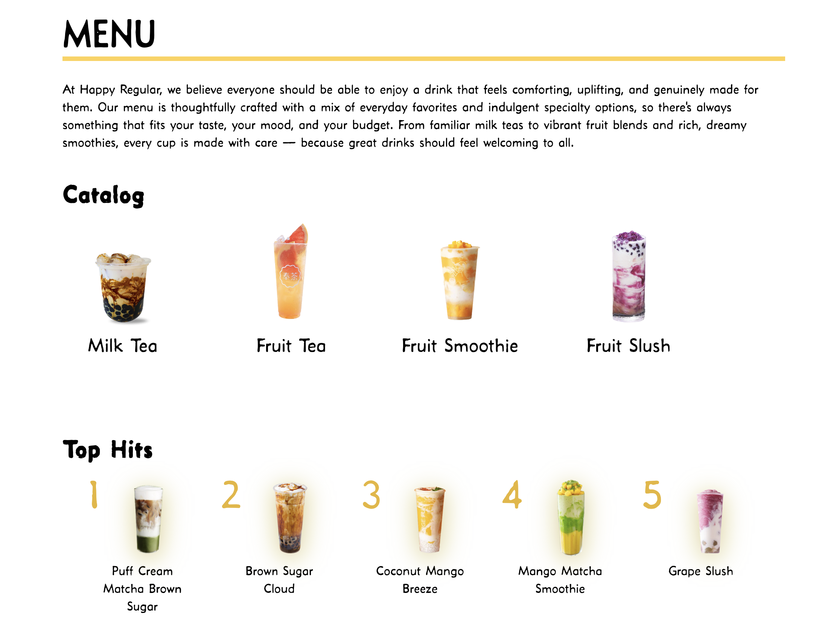

# Front-End Development Portfolio
This collection documents the step-by-step development of websites built across multiple web design courses. Instead of only final outcomes, it highlights the design and technical decisions made at each stage.

## Live Sites
1. Happy Regular Brand Website – https://leviula.github.io/grc338/website-visual-language/

#### These projects demonstrate:
- HTML and CSS fundamentals
- Layout systems (Flexbox, Grid)
- Responsive design with media queries
- Visual hierarchy, spacing, and interaction states
- Debugging and iterative refinement

#### This collection is preserved intentionally to document:
- My learning progression in front-end development
- How design decisions evolve through iteration
- My ability to translate layout and interaction concepts into code

## Notes for Viewers
- Files are meant to be viewed individually, not as a single unified production build.
- Earlier assignments may appear simpler or less refined than later ones by design.
- Later snapshots reflect stronger layout control, hierarchy, and responsiveness.

 

# Project 1: Happy Regular Brand Website
This project demonstrates the application of visual language, brand identity, and responsive layout principles through the design and development of a café-style website. The site translates a brand concept into a cohesive digital experience using structured layout systems, typographic hierarchy, color, and interactive elements.

 

#### It focuses on:
- Building a consistent visual identity through color, type, and spacing
- Implementing responsive layouts with Flexbox and Grid
- Designing clear navigation and content hierarchy
- Creating interaction states for hover, focus, and user feedback
- Applying real-world layout constraints for menu systems and hero sections
